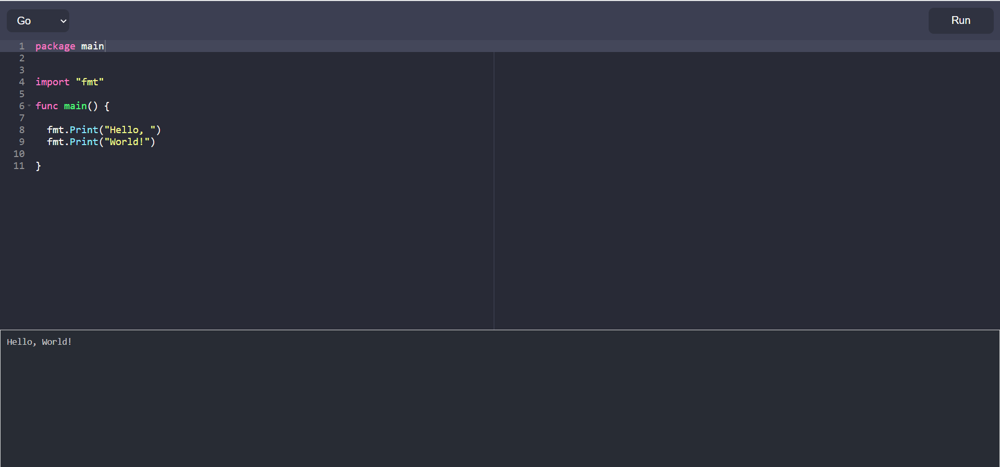

## Overview

This remote code executor is a web application that allows users to write and execute Python and Go code in a web-based environment. The project is built using Node.js and Express for the backend, and React for the frontend. When a user submits code through the editor, the backend creates a Docker container on-the-fly to execute the code. Once the code has finished executing, the output is sent back to the user.

## Installation

To get started with the project, you will need to have Node.js and Docker installed on your machine.
After cloning the repository, install dependencies:

```
npm install
```

After this you will need to build the Docker images for Python and Go execution. So navigate to `docker-files` folder.

```
cd docker-files
```

Build the Docker images using the following commands:

```
docker build -t python-v1 -f PythonDockerfile .
docker build -t go-v1 -f GoDockerfile .
```

This will build two Docker images: one for Python code execution and another for Go code execution.

## Usage

Once the images have been built, you can start the server using :

```
npm start
```

Open a web browser and go to http://localhost:3000
Write code in the editor and click "Run"
The output of the code will be displayed in the console

## Contributing

Contributions are welcome! Fork the repository and submit a pull request.

## ScreenShots


